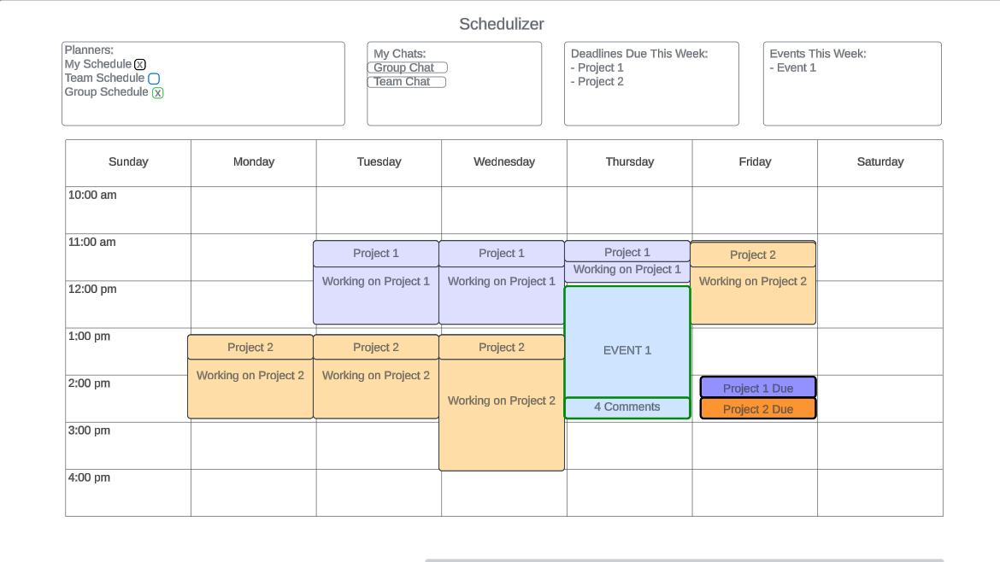

## Startup 260
### CS 260 - Ryan Callahan

# ***Schedulizer***
## A planner application designed for busy schedules and deadlines
Are you finding it hard to keep track of all the busy schedules and deadlines in your life? Then you need
to try out Schedulizer. Schedulizer is a simple planner application designed with deadlines, projects, and
meetings in mind. With Schedulizer, you can effectively plan out what projects you have, when they are due,
and when you will work on them, allowing you to work in harmony with all the other events that happen in life. 
Working on a team? Schedulizer has you covered, with shared planners and features to help you coordinate 
with co-workers, teammates, friends, etc.!

### Core Features:
- Ability to create, edit, view, and utilize multiple planners through the web
- Secure access to your planners through the use of your credentials
- Shared planners with multiple contributors, with comment and chat features to coordinate

### The Technology Used:
- HTML - Used for the login page and the dashboard page. More pages may be added as need is discovered
- CSS - Used for styling the text, the interactive boxes, and the calendar.
- React - The functional aspects of the calendar will be built with React. Check-boxes, buttons, events, etc. will
  use React to interact with the backend.
- Service - available endpoints will be:
  - calendar event CRUD operations
  - login, logout, register. Will require authentication, which will be stored in db
  - Third-party service will be the [https://mhw-db.com](https://docs.mhw-db.com) API, which will display a random
  monster description at the login page for fun.
- DB - used to store user info, authentications, and calendar events
- WebSocket - Calendars can be shared and will be updated in real time

### HTML Deliverable
- HTML Pages - Added four html pages (index, createAccount, dashboard, about) for the functionality of the website
- Links - Every core page can be navigated to from any other core page. A link to the github repo is available in the
footer of every page.
- Text - The final product won't have very much plain text that isn't part of some dialog object, most of it is on the
about page. Relevant info has been added.
- Images - The page doesn't really have a functional use for images, so I'll probably add more once I get to styling
everything. But technically the calendar placeholder is an image, and there's also my unused error page, so...
- Login - Current user is displayed at the top of the header in every page, and obviously on the login page itself.
- 3rd Party placeholder - The third part call will be added to the footer of every page as a random "Monster Hunter"
monster description generated every time the page is initially loaded.
- Database data - Database data will be displayed in the current user info at the top, as well as on the main dashboard
in the form of the calendar itself.
- WebSocket - A live chat box will be placed right below the calendar, and will display the selected chat. Group
calendars will also reload for every user whenever they are updated by any user

### CSS Deliverable
- Header, Footer, Main content body - all are visible and have their own styling within main.css.
- Nav elements - found in the header on each page, styled appropriately according to the page the user is currently on.
- Responsive window resizing - :) I tried
- Application elements - Everything that can be reasonable done without React has been styled, such as the login/create
  account pages, the nav, and the footer.
- Application text content - All text on the site has been appropriately styled and sized to look professional.
- Application images - yes these exist now. all three of them. placeholder text has been removed and images are sized 
  appropriately.

### React Phase 1
- this was indeed bundled using vite
- app.jsx is being used to keep the header and footer uniform regardless of which route is currently selected.
- Routing is being used to select which page is being rendered
- Forms are built using react-bootstrap's Form components